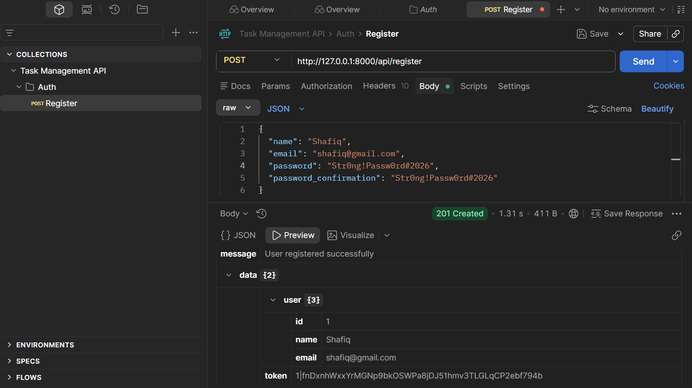
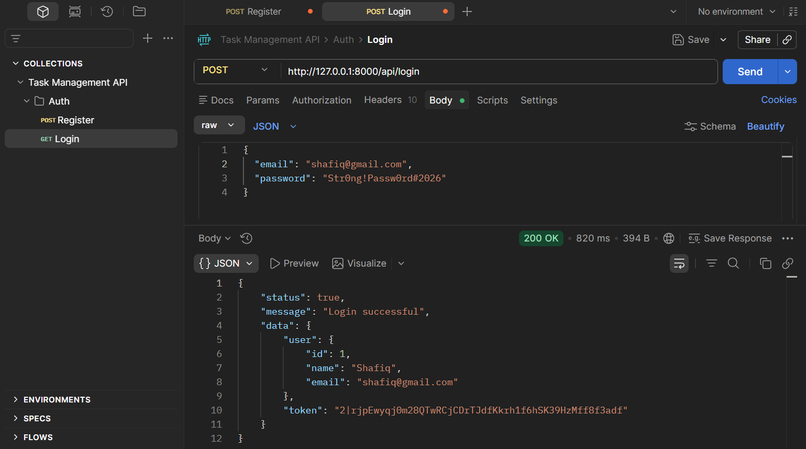
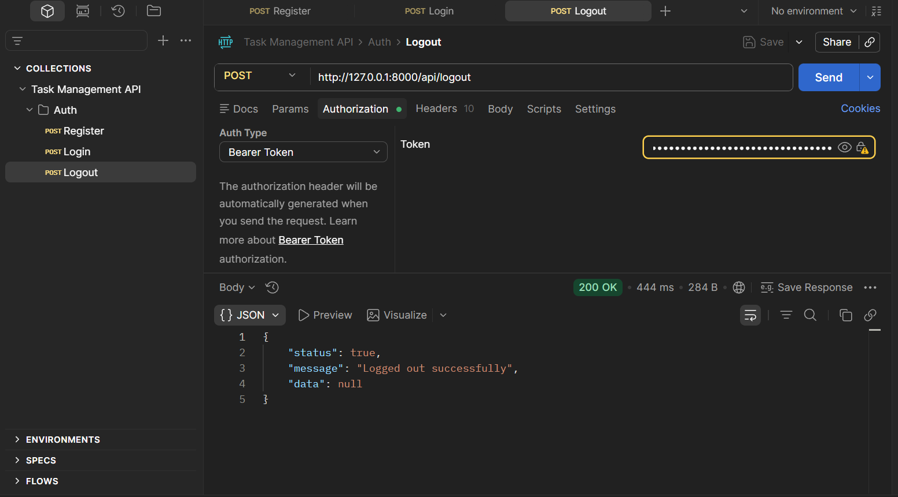
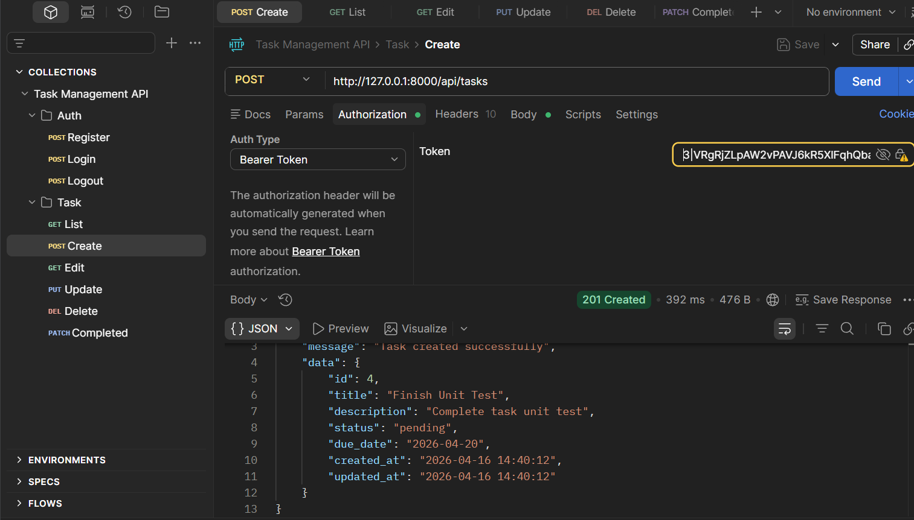
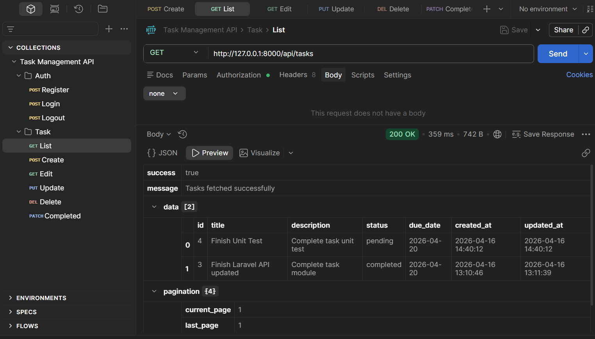
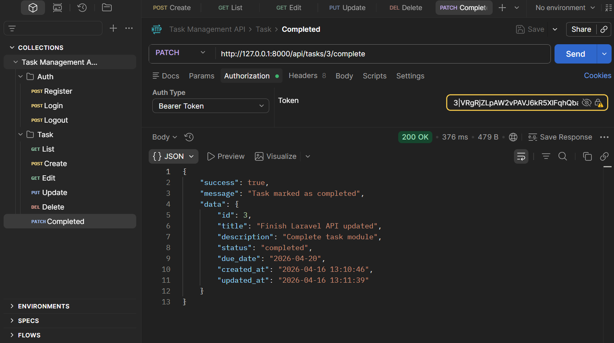

# Task Management API

A RESTful API built with **Laravel** and **Laravel Sanctum** that allows authenticated users to manage their own tasks — create, list, update, delete, and mark as completed.

---

## Tech Stack

- **PHP / Laravel 12**
- **Laravel Sanctum** — token-based authentication
- **MySQL** — database
- **PHPUnit** — unit & feature testing

---

## Setup Instructions

```bash
# 1. Clone the repository
git clone https://github.com/shafiqul-iislam/task-management-api.git
cd task-management-api

# 2. Install dependencies
composer install

# 3. Copy environment file and generate app key
cp .env.example .env
php artisan key:generate

# 4. Configure your database in .env
DB_CONNECTION=mysql
DB_HOST=127.0.0.1
DB_PORT=3306
DB_DATABASE=task_management
DB_USERNAME=root
DB_PASSWORD=

# 5. Run migrations
php artisan migrate

# 6. Start the development server
php artisan serve
```

---

## API Endpoints

### Authentication

| Method | Endpoint | Auth Required | Description |
|--------|----------|:---:|-------------|
| `POST` | `/api/register` | ❌ | Register a new user |
| `POST` | `/api/login` | ❌ | Login and receive a token |
| `POST` | `/api/logout` | ✅ | Logout and revoke token |

### Tasks

| Method | Endpoint | Auth Required | Description |
|--------|----------|:---:|-------------|
| `GET` | `/api/tasks` | ✅ | List all your tasks (with filters) |
| `POST` | `/api/tasks` | ✅ | Create a new task |
| `GET` | `/api/tasks/{id}` | ✅ | Get a single task |
| `PUT` | `/api/tasks/{id}` | ✅ | Update a task |
| `DELETE` | `/api/tasks/{id}` | ✅ | Delete a task |
| `PATCH` | `/api/tasks/{id}/complete` | ✅ | Mark a task as completed |

**Query filters available on `GET /api/tasks`:**

| Parameter | Example | Description |
|-----------|---------|-------------|
| `status` | `?status=pending` | Filter by status (`pending`, `in_progress`, `completed`) |
| `due_date` | `?due_date=2026-04-20` | Filter by due date |
| `search` | `?search=laravel` | Search tasks by title (partial match) |

---

## Authentication Flow

All task endpoints require a **Bearer Token** in the `Authorization` header:

```
Authorization: Bearer <your-token>
```

You receive the token after a successful **Register** or **Login** request.

---

## Registration — Password Requirements

The API enforces strict password rules to protect user accounts:

| Rule | Requirement |
|------|-------------|
| **Minimum length** | At least **8 characters** |
| **Mixed case** | Must contain both **uppercase** and **lowercase** letters |
| **Numbers** | Must contain at least one **number** |
| **Symbols** | Must contain at least one **special character** (e.g. `!`, `@`, `#`) |
| **Uncompromised** | Must **not appear** in known data breach databases |
| **Confirmation** | `password` and `password_confirmation` **must match** |

**Good password example:** `Str0ng!Passw0rd#2026`

**Bad password examples:**
- `password123` — no uppercase, no symbol
- `Password!` — no number
- `SHORT1!` — too short (under 8 characters)
- `password` — known compromised password

---

## Postman Screenshots

### Register — `POST /api/register`



### Login — `POST /api/login`



### Logout — `POST /api/logout`



### Create Task — `POST /api/tasks`



### List Tasks — `GET /api/tasks`



### Mark as Completed — `PATCH /api/tasks/{id}/complete`



---

## Request & Response Examples

### Register

**Request body:**
```json
{
  "name": "Shafiq",
  "email": "shafiq@gmail.com",
  "password": "Str0ng!Passw0rd#2026",
  "password_confirmation": "Str0ng!Passw0rd#2026"
}
```

**Response `201 Created`:**
```json
{
  "message": "User registered successfully",
  "data": {
    "user": { "id": 1, "name": "Shafiq", "email": "shafiq@gmail.com" },
    "token": "1|fnDxnhWxxYrMGNp9bkOSWPa8jDJ51hmv3TLGLqCP2ebf794b"
  }
}
```

---

### Create Task

**Request body:**
```json
{
  "title": "Finish Unit Test",
  "description": "Complete task unit test",
  "status": "pending",
  "due_date": "2026-04-20"
}
```

**Response `201 Created`:**
```json
{
  "success": true,
  "message": "Task created successfully",
  "data": {
    "id": 4,
    "title": "Finish Unit Test",
    "description": "Complete task unit test",
    "status": "pending",
    "due_date": "2026-04-20",
    "created_at": "2026-04-16 14:40:12",
    "updated_at": "2026-04-16 14:40:12"
  }
}
```

---

### Error Response (Validation)

```json
{
  "success": false,
  "message": "The title field is required.",
  "errors": {
    "title": ["The title field is required."]
  }
}
```

---

## Running Tests

```bash
php artisan test
```

The project includes both **Unit** and **Feature** tests:

- **Unit** — tests business logic in `TaskService` directly (no HTTP layer)
- **Feature** — tests the full API endpoints end-to-end

```
PASS  Tests\Unit\TaskServiceTest
✓ creates task with default pending status
✓ find throws not found for missing task
✓ find throws unauthorized for wrong user

PASS  Tests\Feature\TaskApiTest
✓ index requires authentication
✓ store creates task
✓ store requires title
✓ cannot access another users task
✓ mark completed is idempotent
```

---

## Architecture

```
app/
├── Http/
│   ├── Controllers/API/    # Thin HTTP controllers
│   ├── Requests/           # Form Requests (validation)
│   └── Resources/          # API response formatting
├── Services/
│   └── TaskService.php     # Business logic layer
├── Models/
│   └── Task.php
└── Enums/
    └── TaskStatusEnum.php  # pending | in_progress | completed
```
